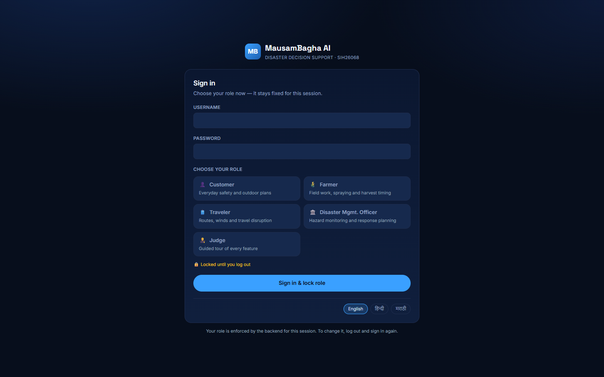
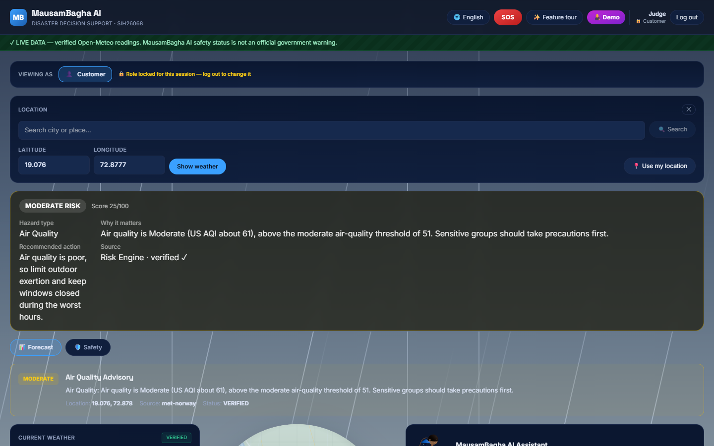
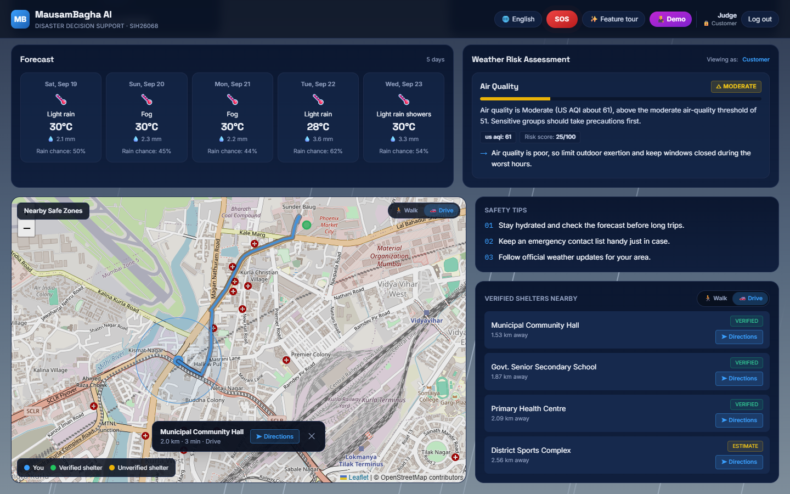
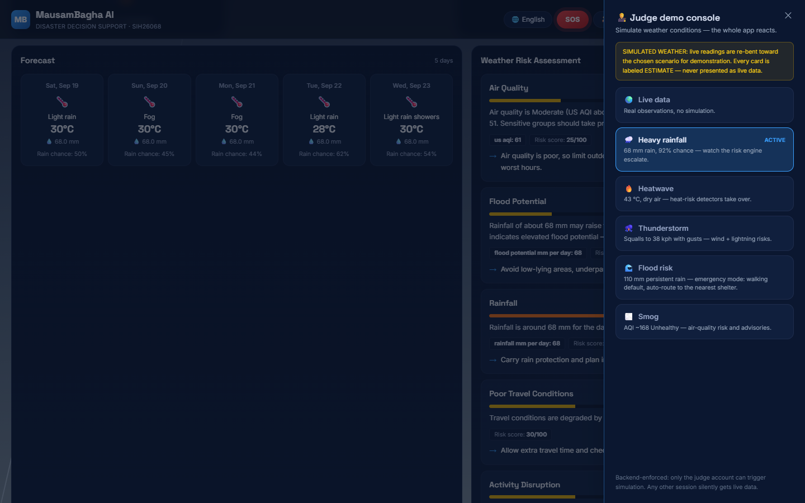

<div align="center">

</div>

# MausamBagha AI — SIH26068


**Hyperlocal weather intelligence and disaster decision support.**

Real weather data comes from free, key-less services (Open-Meteo, MET
Norway); a deterministic risk engine turns it into plain, actionable
guidance for four audiences; an optional AI tier (local Ollama, free
cloud escalation, or any OpenAI-compatible API) answers natural-language
questions grounded strictly in that data; and a safety layer surfaces
status, alerts and checklists. The core weather + risk + safety stack
works entirely without any AI service or paid API.

**Live deployment:** [mausambagha-web.onrender.com](https://mausambagha-web.onrender.com)
(free tier — the first request after ~15 min idle may take ~30 s to wake the API).

## Highlights

- **Real weather, zero keys** — Open-Meteo and MET Norway providers, both
  free and key-less; a resilience layer adds caching, request coalescing,
  stale-serve and honest labeled-fixture fallback so upstream trouble
  never 500s the API.
- **Explainable risk engine** — 9 detectors (rainfall, heat, wind, flood
  potential, air quality…) with IMD/Beaufort/AQI thresholds, 0–100 scores,
  and role-specific guidance; the UI never shows a number it can't explain.
- **Grounded AI chat** — scope guard → local Ollama → free cloud
  escalation chain → data-based fallback. Every reply cites its sources
  and names the tier that answered; the model can't invent measurements.
- **Shelter finder with real routing** — nearby safe zones on a Leaflet
  map, walking/driving toggle, and in-app road routing (OSRM) with a
  turn-by-turn handoff to Google Maps.
- **3D presenter avatar** — drag-to-rotate WebGL assistant that reacts to
  risk changes and holds a prop matching the current weather.
- **Login with session-locked roles** — pick customer / farmer / traveler /
  officer once at sign-in; the backend enforces it for the session.
- **🧑‍⚖️ Evaluators: skip the setup** — sign in with the [judge demo
  account](#judge-demo-walkthrough) for a self-guided tour and a console that
  simulates five weather emergencies live.
- **Trilingual UI** — English, हिन्दी, मराठी across the whole page,
  including voice input.

## Quick start (Docker)

```bash
cp .env.example .env     # then set AUTH_ADMIN_PASSWORD (required)
docker compose up --build
# dashboard: http://localhost:5173  ·  API: http://localhost:8000/health
```

No API keys needed — weather and risk work out of the box on free
providers. See below for AI setup and the production stack.

## Deployment

The production stack is two Render services — a static frontend (`weathergpt-web`) and the Dockerized FastAPI backend (`Weather-GPT-1`) — with pushes to `main` auto-deploying per service (filtered by rootDir), manual deploy/rollback via the Render API or dashboard, and a post-deploy verification battery.

**Full procedures live in [DEPLOYMENT.md](DEPLOYMENT.md)** — push-to-deploy behavior, manual triggers, rollback, env-var handling, and the known gotchas (Blueprint drift, auth seeding).

## Screenshots

**Sign in and pick your role once — it stays locked for the session.**



**Live weather, explainable risk, forecast and the 3D presenter avatar.**



**Shelter routing drawn in-app — real road distance and ETA per mode.**



**Judge demo console — re-bend live weather into five scenarios and watch the whole app react (SIMULATED banner on, ESTIMATE labels everywhere).**



## The pipeline

```
USER → LOCATION (typed coords, device geolocation, or place-name search)
  → REAL OPEN-METEO WEATHER        (open_meteo provider, no key)
  → AIR-QUALITY ENRICHMENT         (US AQI via Open-Meteo, no key, optional)
  → WEATHER NORMALIZATION          (WeatherReading / ForecastDay + AirQuality)
  → HYPERLOCAL RISK ENGINE         (9 detectors, configurable thresholds)
  → ROLE-AWARE INTERPRETATION      (customer | farmer | traveler | officer)
  → SAFETY STATUS                  (normal / watch / warning / critical)
  → LOCAL RAG KNOWLEDGE            (curated TF-IDF knowledge base)
  → OPTIONAL OLLAMA AI             (graceful fallback when absent)
  → CONVERSATIONAL GUIDANCE        (/chat with sources + fallback flag)
  → SAFETY DASHBOARD               (React: status, alerts, checklist)
```

## Phase status

| Phase | Scope | Status |
| --- | --- | --- |
| 1 | Docker + PostgreSQL + FastAPI + React foundation | ✅ `docker compose up` stack |
| 2A | Real Open-Meteo weather → API → React | ✅ verified live |
| 2B | Hyperlocal risk engine + 4 roles | ✅ backend test suite green |
| 3 | Ollama/local AI + RAG + conversational guidance | ✅ optional & fallback-safe |
| 4 | SIH safety features (status, alerts, checklists) | ✅ deterministic layer |
| 5 | Deployed on Render + in-app OSRM routing proxy | ✅ live, see [DEPLOYMENT.md](DEPLOYMENT.md) |
| 6 | Judge demo suite: scenario simulation, feature tour, emergency auto-response | ✅ judge-account gated |

## Architecture

```
WeatherProvider (WEATHER_PROVIDER env var)
├── MockWeatherProvider        demo scenarios, is_verified=false
├── OpenMeteoWeatherProvider   free live data, key-less
└── MetNorwayWeatherProvider   free live data, key-less, cloud-egress-friendly
        │  every live provider is wrapped in ResilientWeatherProvider:
        │  response cache · request coalescing · 429 retry · stale-serve
        │  · labeled-fixture fallback (upstream trouble never 500s)
        │  + OpenMeteoAirQualityProvider (key-less US-AQI enrichment,
        │    failure-tolerant — AQI problems never break weather)
        │  normalizes into
        ▼
WeatherReading / ForecastDay    canonical models (app/services/weather/base.py)
        │
        ▼
RiskEngine (app/services/risk/) detectors → RiskItem(severity, score)
        │  thresholds + role priorities + guidance from profiles/*.json
        │  judge-only: ScenarioOverlayProvider re-bends live readings
        │  toward demo scenarios (server-side gate; public users get
        │  genuine data, simulated cards are labeled ESTIMATE)
        ▼
Role overlay (customer | farmer | traveler | disaster_management_officer)
        │
        ▼
SafetyEngine (app/services/safety/) → status, alerts, checklists
        │  official alerts only via a SafetyAlertProvider (none by default)
        ▼
FastAPI routes (/api/v1/weather/*, /risk, /safety, /chat, ...)
        │
        ▼
React dashboard — weather, risks, forecast, role selector, AI chat, safety
```

Layering rules kept in the code:

- Weather providers know nothing about risk; the risk engine knows
  nothing about HTTP or provider payloads; safety derives from risks.
- The AI layer only ever reasons over structured weather/risk context
  plus retrieved knowledge-base documents — it cannot invent numbers.
- Provider/AI/RAG/official-feed failures degrade gracefully; nothing
  upstream can 500 the weather API.

## Backend setup

```
cd backend
python -m venv .venv && source .venv/bin/activate   # Windows: .venv\Scripts\activate
pip install -r requirements.txt
cp .env.example .env        # edit DATABASE_URL etc.
uvicorn app.main:app --reload --port 8000
```

`/health` should return `{"status": "ok"}`. Defaults to
`WEATHER_PROVIDER=mock` and `AI_PROVIDER=mock` — no external keys needed.

SOS events and safety-event history are persisted via SQLAlchemy — point
`DATABASE_URL` at Postgres (or `sqlite:///./dev.db` for quick testing)
and create tables once:

```
python -c "from app.db.session import Base, engine; from app.models import models; Base.metadata.create_all(engine)"
```

## Frontend setup

```
cd frontend
npm install
npm run dev
```

Vite proxies `/api` to `http://localhost:8000` in dev (see
`vite.config.js`). Production build: `npm run build`.

## Docker setup (development)

```
cp .env.example .env               # first run only — then edit it
docker compose up --build          # db + backend + frontend
docker compose --profile ai up -d  # also start optional local Ollama
```

`AUTH_ADMIN_PASSWORD` is **required by both stacks**, development included:
without it `docker compose up` stops with a clear message instead of starting
on the published `admin123` default. Everything else in `.env` has a working
fallback, so the only value you must supply is the admin password.

- `db`: PostgreSQL 16 with PostGIS and a healthcheck; `DATABASE_URL`
  points the backend at it automatically.
- `backend`: FastAPI on :8000 (Open-Meteo by default).
- `frontend`: Vite dev server on :5173 (hot reload, bind-mounted source).
- `ollama` (profile `ai`): local models volume; pull a model once with
  `docker compose exec ollama ollama pull llama3.2` and set
  `AI_PROVIDER=ollama`.

This stack is for development: it runs a Vite dev server and installs
dependencies at container start. For a real deployment use the production
stack below.

## Deployment (production)

> **Live on Render?** See [DEPLOYMENT.md](DEPLOYMENT.md) for the hosted runbook
> (push-to-deploy, manual triggers, rollback). This section covers self-hosting
> the production stack with Docker Compose.

The production stack builds real images (no dev server, no bind mounts,
dependencies installed at image build time) and publishes exactly one port.

```
# 1. create your environment file — the templates hold placeholders only
cp .env.example .env
#    …then edit it. Production REQUIRES AUTH_ADMIN_PASSWORD, and you should
#    set CORS_ORIGINS, DOCS_ENABLED and POSTGRES_* deliberately.

# 2. build the images
docker compose -f docker-compose.prod.yml build

# 3. start the stack (add --profile ai to include optional local Ollama)
docker compose -f docker-compose.prod.yml up -d
```

- **Frontend:** `http://localhost/` — host port `FRONTEND_PORT`, default
  80. Nginx serves the built SPA and reverse-proxies `/api/` to the
  backend, so the browser only ever talks to one origin (CORS is not
  exercised in production).
- **Backend:** available as `http://backend:8000` **inside** the compose
  network only — it is deliberately not published. Check it through the
  container health status, or run the probe directly:
  `docker compose -f docker-compose.prod.yml exec backend python -c "import urllib.request;print(urllib.request.urlopen('http://127.0.0.1:8000/health').read().decode())"`
- **Database:** PostgreSQL 16 + PostGIS on the `pgdata` volume, internal
  only. Tables are created and the admin account is seeded on first start.
- **Ollama (optional):** internal only. Enable with `--profile ai`, then
  `docker compose -f docker-compose.prod.yml exec ollama ollama pull llama3.2`
  and set `AI_PROVIDER=ollama` (or `hybrid`).

Day-to-day operations:

```
docker compose -f docker-compose.prod.yml ps               # status + health
docker compose -f docker-compose.prod.yml logs -f          # follow all logs
docker compose -f docker-compose.prod.yml logs -f backend   # one service
docker compose -f docker-compose.prod.yml up -d --build    # rebuild + restart
docker compose -f docker-compose.prod.yml restart backend  # reload code only
docker compose -f docker-compose.prod.yml down             # stop (keeps volumes)
docker compose -f docker-compose.prod.yml down -v          # stop AND delete data
```

Things worth knowing before you expose it:

- The production stack runs under its own compose project
  (`weathergpt-prod`), so it gets its own `pgdata` volume: deploying never
  disturbs development data, and the first start initializes a fresh
  schema.
- `AUTH_ADMIN_PASSWORD` has **no fallback** — `up` fails fast with a clear
  message instead of starting with a published default. Seeding is
  idempotent, so it only creates accounts that do not exist yet.
- Set `AUTH_DEMO_PASSWORD` (or delete the `demo` account) before public
  use: it is a known-credential login otherwise.
- With `ENV=production` the backend logs a `startup.insecure_default`
  warning naming any variable still on a development default. Variable
  names only — values are never logged.
- Env changes need a container recreate (`up -d`, which detects the
  change), not `restart`: `restart` reuses the existing container's
  environment.
- Traffic is plain HTTP on `FRONTEND_PORT`. Put a TLS terminator in front
  (your own reverse proxy, a load balancer, or a tunnel) for public use.
- Secrets stay in `.env`, which is gitignored. No secret is baked into an
  image: the backend image copies only `requirements.txt` and `app/`.

## Environment variables (backend)

| Variable | Values | Purpose |
| --- | --- | --- |
| `WEATHER_PROVIDER` | `mock` \| `open_meteo` \| `met_norway` | Weather data source. Both live providers are free and key-less; `met_norway` is the choice for cloud deployments (Open-Meteo blocks shared cloud egress IPs). |
| `WEATHER_API_BASE_URL` | URL (optional) | Override the Open-Meteo endpoint. |
| `AIR_QUALITY_ENABLED` | bool | Key-less US-AQI enrichment for `open_meteo` (failure-tolerant). |
| `RISK_PROFILE` | profile name | Selects `app/services/risk/profiles/<name>.json`. |
| `ROUTING_OSRM_BASE_URL` | URL (optional) | Base URL of the OSRM proxy upstream (default: the public FOSSGIS instance). Point at a self-hosted OSRM for heavy traffic. |
| `AI_PROVIDER` | `mock` \| `ollama` \| `hybrid` \| `openai` | Chat brain. Mock is rule-based and always available. `hybrid` = Ollama first, then the escalation chain. |
| `ESCALATION_PROVIDER` | `auto` \| `ovhcloud` \| `groq` \| `solar` \| `openai` | Cloud fallback tier. `auto` picks a working free default; `solar` reads `SOLAR_API_KEY` for backward compat. |
| `ESCALATION_PROVIDERS` | comma list | Optional ordered failover chain, e.g. `groq,ovhcloud`. Rate-limited providers are skipped temporarily. |
| `AI_API_KEY` | secret (optional) | Key for the selected escalation provider. **Backend-only** — never expose to the frontend or Git. |
| `SOLAR_API_KEY` | secret (optional) | Legacy Solar (Upstage) key; still honored when `ESCALATION_PROVIDER=solar`. |
| `OLLAMA_BASE_URL` | URL | Local Ollama server (default `http://localhost:11434`). |
| `OLLAMA_MODEL` | model tag | e.g. `llama3.2`, `mistral`, `qwen2.5`. |
| `RAG_ENABLED` / `RAG_TOP_K` | bool / int | Local retrieval over the curated knowledge base. |
| `SAFETY_ALERT_PROVIDER` | `null` | Official-alert source. `null` = never fabricate official alerts. |
| `DATABASE_URL` | SQLAlchemy URL | Persistence (SOS events, safety history). SQLite works locally. |
| `SOS_DISPATCH_ENABLED` | bool | Keep `false` until a real dispatch integration exists. |
| `AUTH_AUTO_INIT_DB` | bool (default `true`) | Create missing tables and seed the accounts below at startup (idempotent — existing rows are never reset). |
| `AUTH_ADMIN_USERNAME` / `AUTH_ADMIN_PASSWORD` | str / **required** | Admin account; unlocks the admin panel. No published default. |
| `AUTH_DEMO_USERNAME` / `AUTH_DEMO_PASSWORD` | str / str (default `demo` / `demo123`) | Plain citizen demo account. Rotate before public exposure. |
| `AUTH_JUDGE_ENABLED` / `AUTH_JUDGE_USERNAME` / `AUTH_JUDGE_PASSWORD` | bool / str / str (default `true` / `judge` / `judge123`) | Judge account: feature tour + demo console (see [Judge demo walkthrough](#judge-demo-walkthrough)). Rotate before public exposure. |
| `AUTH_SESSION_TTL_HOURS` | int (default `12`) | Login-session lifetime. |

Frontend: `VITE_API_BASE_URL` (optional — dev proxy covers local runs).

- **Air quality**: `AIR_QUALITY_ENABLED` (default `true`) enriches
  `open_meteo` readings with key-less US AQI from the Open-Meteo
  Air-Quality API; any failure degrades to "no AQI shown" without
  affecting weather. The mock provider ships deterministic per-scenario
  AQI (including a `smog` demo scenario), so the demo works offline.

## Open-Meteo setup

Nothing to install and no key: set `WEATHER_PROVIDER=open_meteo`. The
provider requests current conditions + hourly + daily fields, maps WMO
weather codes to human descriptions, converts wind bearings to compass
points, and normalizes everything into the canonical models. Readings
are marked `is_verified=true` with `source="open-meteo"`. Timeouts,
connection failures, HTTP errors and malformed payloads raise typed
`WeatherProviderError`s that the API maps to 422/502/503.

## Ollama setup (optional)

1. Install [Ollama](https://ollama.com) and start it (`ollama serve`).
2. Pull a model: `ollama pull llama3.2` (any chat model works).
3. In `backend/.env`: `AI_PROVIDER=ollama`, `OLLAMA_MODEL=llama3.2`.

If Ollama is not running, `/api/v1/chat/send` still answers — with a
deterministic, role-aware summary of the real weather/risk data and
`fallback_used: true` so the UI can label it. AI failure never affects
weather, risk or safety endpoints.

## AI escalation chain (Ollama first, free cloud fallback)

`AI_PROVIDER=hybrid` routes every question through the local model
first and escalates to a cloud tier only when needed:

1. **Scope guard** — obvious nonsense/off-topic input is refused
   without any AI call (free, instant, localized).
2. **Local Ollama** (free) answers normal weather/safety questions.
3. **Escalation chain** — `ESCALATION_PROVIDER` (default `auto`) or an
   ordered failover list in `ESCALATION_PROVIDERS`. Free keyless tiers
   (e.g. `ovhcloud`) work out of the box; keyed tiers (`groq`, `solar`,
   any OpenAI-compatible endpoint via `AI_API_KEY`) plug in with one
   env var. A provider that rate-limits is skipped temporarily.
4. **Data-based guidance** (existing fallback) only when ALL tiers
   fail — `fallback_used: true`.

Each response carries `provider` (`ollama` \| `ovhcloud` \| `groq` \|
`solar` \| `scope_guard` \| `mock` \| `fallback`) so you can see which
tier answered, and the admin panel exposes live AI metrics (requests,
fallbacks, latency per tier).

To enable: set `AI_PROVIDER=hybrid` and start the Ollama profile
(`docker compose --profile ai up -d`). Cloud escalation works keylessly
by default; add a key only if you want a specific provider.

## RAG setup

Retrieval is 100% local and dependency-free: TF-IDF cosine similarity
over `app/services/ai/knowledge/india_weather_safety.json`, a curated
knowledge base of trusted safety guidance (rain, heat, wind, storms,
travel, farming, preparedness, official sources). No internet content
is ingested and sources are always citable by title. Swap in your own
corpus via `RAG_KNOWLEDGE_DIR`; tune result count with `RAG_TOP_K`.

## Risk engine

Thresholds (from `profiles/default.json`, editable):

- **Rainfall** (IMD daily classes): moderate ≥ 35.6 mm, high ≥ 64.5 mm,
  extreme ≥ 115.6 mm per day.
- **Wind** (Beaufort-derived, from the 10.8 / 17.2 / 24.5 m/s baseline):
  moderate ≥ 38.9 kph, high ≥ 62 kph, extreme ≥ 88.2 kph.
- **Heat** (air and apparent/feels-like): moderate ≥ 32 °C, high ≥ 40 °C,
  extreme ≥ 46 °C.
- **Flood potential** starts at 64.5 mm/day: *weather conditions may
  increase flood risk in low-lying/poorly drained areas* — the app never
  claims flooding is observed.
- **Air quality** (US AQI): moderate ≥ 51, high ≥ 101, extreme ≥ 151 —
  active only when real AQI data exists (Open-Meteo enrichment or the
  mock `smog` scenario); a reading without AQI stays silent, never guesses.

Detectors: rainfall, high temperature, heat stress, strong wind, severe
weather (thunderstorm-class WMO codes) + composites: flood potential,
poor travel conditions, activity disruption + air quality (data-gated).
Each yields severity
(LOW/MODERATE/HIGH/EXTREME), an explainable 0–100 score derived from
threshold distance, an explanation naming the measured value and
threshold, and role-specific guidance. The role overlay reorders risks
per `role_priorities` and swaps guidance — never the measurements.

## Roles

- **Customer** — general awareness and everyday precautions (default).
- **Farmer** — rainfall, heat, wind, field-work and irrigation planning.
- **Traveler** — travel conditions, disruption, practical precautions.
- **Disaster Management Officer** — severe weather, flood potential,
  monitoring/escalation guidance.

The role is chosen once on the login screen and locked onto the server
session — changing it requires logging out, and every API request is
authorized and role-resolved from the session token (not from the client).

## Judge demo walkthrough

**🎬 Prefer watching?** A 72-second recorded walkthrough of the judge
experience — sign-in, dashboard, the demo console driving all five weather
scenarios, and shelter directions — is in the repo:
[`docs/demo/mausambagha-demo.mp4`](docs/demo/mausambagha-demo.mp4).

The app ships a special **judge account** for reviewers and evaluators:
sign in as `judge` (default password `judge123`) — you'll see the full
citizen dashboard, no role pick needed, plus two extras no other account gets:

1. **A guided feature tour auto-opens** — an 8-step spotlight walkthrough of
   every feature (live weather, explainable risks, the overall gauge, grounded
   chat, forecast, the 3D presenter, shelter routing, and SOS). Escape/✕ skips
   it; the ✨ Feature tour button in the header replays it anytime.
2. **The 🧑‍⚖️ Demo console** appears in the header. It re-bends the *live*
   weather feed toward five scenarios so the whole app visibly reacts:

   | Scenario | What to watch |
   |---|---|
   | 🌧️ Heavy rainfall | 68 mm — the risk engine escalates to HIGH on its own |
   | 🔥 Heatwave | 43 °C dry heat — heat detectors take over |
   | ⛈️ Thunderstorm | 38 kph squalls — wind + lightning risks |
   | 🌊 Flood risk | 110 mm — the full emergency cascade: travel mode auto-switches to walking, an amber hint appears, and the map auto-routes to the nearest shelter |
   | 🌫️ Smog | AQI ~168 Unhealthy — air-quality advisories |

   Click **🌍 Live data** to snap back to genuine observations. While a
   scenario is active a **SIMULATED** banner shows and affected cards are
   labeled **ESTIMATE** — the demo never misrepresents data provenance.

Scenario requests are **enforced server-side**: only sessions belonging to
the judge account can pass the `scenario` parameter — regular/demo logins
silently get real data. The account is configured with `AUTH_JUDGE_*`
settings (`AUTH_JUDGE_ENABLED=false` disables it) and, like admin/demo, is
seeded idempotently at startup. **The deployment at
[mausambagha-web.onrender.com](https://mausambagha-web.onrender.com) uses a
rotated judge password** — if the default doesn't work there, that's why;
self-hosted instances use the default.

## Demo account

For a quick look without the judge extras, sign in as `demo` (default
password `demo123`) — the plain citizen dashboard: live weather, the
explainable risk engine, grounded chat, the shelter map with routing,
and the ✨ Feature tour button in the header (it just doesn't auto-open,
and there's no 🧑‍⚖️ Demo console). Administrators sign in with the
`AUTH_ADMIN_*` credentials they set themselves.

Same seeding rules as the judge account: the account is created
idempotently at startup from `AUTH_DEMO_*` settings, and
**the public deployment uses a rotated demo password** — self-hosted
instances get the default. Before exposing a deployment publicly, set
real `AUTH_DEMO_PASSWORD` / `AUTH_JUDGE_PASSWORD` values: the defaults
are published here by design, so a deployment that keeps them is a
known-credential login.

## AI safety / hallucination control

The system prompt and architecture enforce: never invent weather values;
never claim official alerts; never invent sources; never diagnose
medical conditions; separate facts from recommendations; state
uncertainty; defer to local authorities for disaster-scale questions.
Grounding is structural — the model only receives the JSON weather
context, detected risks, and retrieved knowledge titles/content.

## Safety features (Phase 4)

- **MausamBagha AI Safety Status**: deterministic escalation
  NORMAL → WATCH → WARNING → CRITICAL mapped from risk severity.
  Explicitly labeled as MausamBagha AI's own interpretation — *not* an
  official government warning level.
- **Alerts**: generated from detected risks (moderate+), with
  deterministic IDs for de-duplication, source attribution, and
  recommended actions. Official alerts can only come from a configured
  `SafetyAlertProvider`; the default ships none and the UI separates
  "MausamBagha AI-generated" from "official".
- **Checklists**: risk-driven, role-capped, general safety items plus
  always-on preparedness reminders.
- **Emergency info**: India's national helpline (112) and pointers to
  official portals (IMD/NDMA) — no invented local numbers.
- **SafetyEvent history**: optional lightweight persistence
  (type, severity, ~1 km-rounded coordinates, timestamp, status — no
  personal data).

## API endpoints

| Endpoint | Notes |
| --- | --- |
| `GET /api/v1/geo/search?query=&count=1..10` | Key-less place-name search (Open-Meteo Geocoding). Unknown names are an empty 200, not an error. |
| `GET /api/v1/weather/current?latitude=&longitude=` | Weather + overall risk (legacy shape). `weather.air_quality` carries US AQI when available. |
| `GET /api/v1/weather/forecast?latitude=&longitude=&days=1..14` | Multi-day forecast. |
| `GET /api/v1/risk?latitude=&longitude=&role=` | Full role-aware assessment. |
| `GET /api/v1/safety?latitude=&longitude=&role=` | MausamBagha AI Safety Status + alerts + checklist. |
| `POST /api/v1/chat/send` | Grounded chat: weather + risks + RAG + AI (or fallback). Returns `fallback_used`, `sources`, weather and risk context. |
| `GET /api/v1/safe-zones/nearby?latitude=&longitude=` | Fixture shelters (placeholder registry). |
| `GET /api/v1/routing/route?from_lat=&from_lon=&to_lat=&to_lon=&mode=driving\|walking` | Road route via the backend's OSRM proxy. Coordinates come back in `[lat, lon]` order; 404 = genuinely no road for that mode. |
| `GET /api/v1/routing/travel-times?from_lat=&from_lon=&to_lat=lat,lon;lat,lon&mode=` | Minutes from one origin to up to 25 destinations in one OSRM table request — powers the shelter list's per-mode time badges. All routing goes through the backend so every visitor shares one server-side cache (per ~110 m cell + mode, 5–10 min TTL) and FOSSGIS sees a single well-behaved client instead of uncoordinated public traffic. |
| `POST /api/v1/sos/trigger` | Logs an SOS event; never reports dispatch unless truly enabled. |
| `POST /api/v1/auth/login` / `GET /auth/session` / `POST /auth/logout` | Session auth (`X-Session-Token`). Login response flags `is_admin` and `is_judge`. |
| `GET /api/v1/admin/overview` · `GET /admin/sessions` | Admin panel data: model tiers + live AI metrics, RAG/deterministic config, and every active session with its locked role. Admin-only (403 otherwise). |
| `GET /health` | Liveness + app info. |

Latitude ∈ [-90, 90], longitude ∈ [-180, 180]; violations and provider
failures return clean 422/502/503 errors with readable messages.

## Testing

Backend (405 tests; all external HTTP mocked — no live Open-Meteo, AQI,
geocoding or Ollama in CI):

```
cd backend
python -m pytest -q
```

Covers: provider mapping and failures, threshold boundaries (e.g.
35.5/35.6 mm, 64.4/64.5 mm, 115.5/115.6 mm; US-AQI 50.9/51.0,
100.9/101.0, 150.9/151.0), detectors, composites, air-quality provider +
enrichment (AQI failure never breaks weather), geocoding service +
endpoint, scoring, role overlay, profile config, RAG retrieval, Ollama
provider (unavailable/404/malformed/grounding), chat grounding +
fallback, safety alerts/escalation/checklists/endpoint, and API
validation.

Frontend:

```
cd frontend
npm run build     # production build must succeed
```

## Development commands

| Command | Where | Does |
| --- | --- | --- |
| `uvicorn app.main:app --reload --port 8000` | `backend/` | Run the API. |
| `python -m pytest -q` | `backend/` | Run backend tests. |
| `npm run dev` | `frontend/` | Vite dev server (proxies `/api`). |
| `npm run build` | `frontend/` | Production build. |
| `npm run lint` | `frontend/` | ESLint over the frontend source. |
| `docker compose up` | repo root | Development stack (db + api + web). |
| `docker compose --profile ai up -d` | repo root | Also run Ollama. |
| `docker compose -f docker-compose.prod.yml up -d --build` | repo root | Production stack (built images, nginx on 80). |

## Safety limitations (honest scope)

- MausamBagha AI does **not** replace government emergency systems; it
  complements official warnings and services.
- No official alert feed ships by default — official alerts are never
  fabricated, and none appear until a real `SafetyAlertProvider` exists.
- FLOOD_POTENTIAL means conditions *may* raise flood risk — no flood
  observation, lightning-density, wildfire or marine claims.
- AIR_QUALITY risk appears only when real AQI data exists (Open-Meteo
  CAMS model data via the key-less Air Quality API, or the mock `smog`
  fixture). It is model-based air quality, not a ground-station
  measurement; mock AQI is clearly labeled unverified in the UI.
- Emergency information is limited to authoritative national numbers
  (India: 112) and official portals; no invented local contacts.
- Checklist content is general safety guidance, not agricultural,
  medical, or structural engineering advice.

## Known limitations / future improvements

- No frontend unit-test framework yet (backend is comprehensively
  tested; frontend is verified via `npm run lint`, the production build
  and live preview).
- No database migrations yet: the schema is created with SQLAlchemy
  `create_all` at startup, which adds missing tables but cannot alter
  existing ones. A future schema change needs Alembic (or a deliberate
  migration step) before it can ship.
- Chat history is in-memory per session (DB persistence is scaffolded
  via `ChatMessage`).
- `SafetyEvent` persistence is schema-ready but not yet written by the
  API (write path is a deliberate future step to avoid unbounded rows).
- PostGIS-specific geospatial queries are not yet used; the Postgres
  foundation is in place for them.
- Future: real IMD/NDMA alert provider, user accounts, push alerts,
  multilingual AI replies beyond the existing UI i18n.

## Login & accounts

The dashboard is gated by a session login; the role chosen at sign-in is
locked server-side for the session (log out to change it). Accounts are
seeded idempotently at first start:

- **Admin** — `AUTH_ADMIN_USERNAME` / `AUTH_ADMIN_PASSWORD` (required to
  set; no default is published). Unlocks the admin panel: AI-provider
  metrics, escalation-chain status, and system configuration view.
- **Demo** — `AUTH_DEMO_USERNAME` / `AUTH_DEMO_PASSWORD` (default
  `demo` / `demo123`). Plain citizen view. Change or disable it before
  any public exposure; it is a known credential.
- **Judge** — `AUTH_JUDGE_USERNAME` / `AUTH_JUDGE_PASSWORD` (default
  `judge` / `judge123`), disable with `AUTH_JUDGE_ENABLED=false`.
  Citizen view plus the feature tour and demo console — see the
  [Judge demo walkthrough](#judge-demo-walkthrough).

Sessions are stateless tokens (`X-Session-Token`, TTL
`AUTH_SESSION_TTL_HOURS`, default 12).

## License

Released under the [MIT License](LICENSE).
